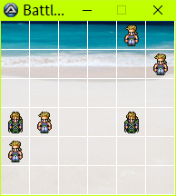
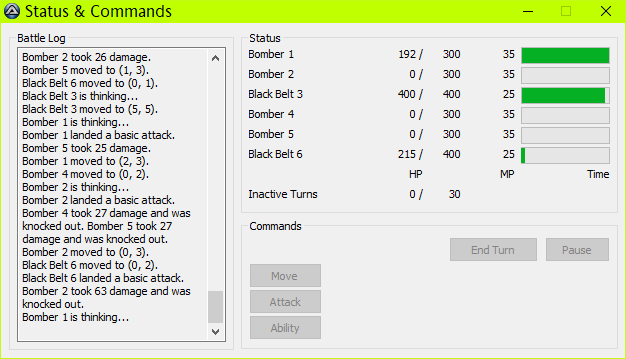

# Active Time Battle-Based Strategy Game Project

by Duc Tran Duy

-----

## 1. Introduction

This project is a game created as a project for Duc's research about _AI in strategy games_. Note that this notion of AI refers to the _["game AI"](https://en.wikipedia.org/wiki/Artificial_intelligence_in_video_games)_ (consisting of algorithms for NPCs) rather than _"true AI"_ (using machine learning).

This game combines Active Time Battle as seen in games such as Final Fantasy 6 and strategy found in Final Fantasy Tactics Advance. It uses AutoIt scripting language, which can be easily used for GUI, simple graphics, easy array copying, and dynamic array resizing operations.

Sprite images _(from Final Fantasy 6)_ are not included. They can be downloaded at http://www.videogamesprites.net/FinalFantasy6/. Images might need to be renamed in the script.

-----

## 2. Detailed Information

### 2.1. Map

The map consists of a 6×6 board with no terrain _(the map size is customizable)_. Each team, consisting of 3 members, is located at either side of the board. The left (enemy) team can select the initial location for characters within the first two columns of the board. Likewise, the right (ally) team can select within the last two columns of the board. The position of a character is unique; no squares are occupied by more than one character.



### 2.2. Method of Determining Distance

The distance between two squares is calculated upon the Manhattan distance formula.

Let `abs` be the absolute value function and `distance` be the distance from the point with coordinates `(x1, y1)` to the point `(x2, y2)`, the formula is:
```
distance = abs(x2 - x1) + abs(y2 - y1);
```

### 2.3. Character Properties

Properties of a character include the following:
* _Hit Points:_ Determines how much damage a character can sustain. Characters with 0 HP are considered knocked out and are removed from the map for the remainder of the game.
* _Magic Points:_ Determines how many special abilities a character can cast until the end of the game. However, special abilities are temporarily removed for simplicity; therefore, this property is unused.
* _Attack:_ Determines the amount of damage a character can deal to the target.
* _Defense:_ Determines the amount of damage to be reduced. The incoming damage multiplier is calculated based on the formula from League of Legends:
  ```
  if (defense >= 0) 
    damageMultiplier = 100 / (100 + defense);
  else
    damageMultiplier = 2 - (100 / (100 - defense));
  ```
* _Attack Range:_ Determines the maximum distance from the character’s current position to an attack target.
* _Attack Area:_ Determines the maximum distance from the center square where the attack is issued to the attack targets.
* _Speed:_ Determines how fast the ATB bar is filled.
* _Movement Range:_ Determines the maximum distance that a character can move during his turn.

There are in-game properties in addition to the preceding ones:
* _Time:_ ATB bar filling progress.
* _X:_ Abscissa of the character (i.e. the column he is standing).
* _Y:_ Ordinate of the character (i.e. the row he is standing).

### 2.4. Character Classes

There are five character classes with distinct playing styles:
* _Fighter:_ Weak attacking power, sturdy defense.
* _Black Belt:_ Strong attacking power.
* _Archer:_ Long attacking range, poor defense.
* _Assassin:_ Long movement range, extremely poor defense, and high speed for better mobility.
* _Bomber:_ Able to damage surrounding enemies, poor defense.

The following table is the detailed properties of each class:

|                Class|   HP|  Atk|  Def|  Rng| Area|  Spd|  Mov|
|---------------------|-----|-----|-----|-----|-----|-----|-----|
|              Fighter|  500|   30|   45|    1|    0|   40|    2|
|           Black Belt|  400|   70|   30|    1|    0|   25|    2|
|               Archer|  300|   30|   15|    3|    0|   35|    2|
|             Assassin|  250|   45|   15|    1|    0|   80|    3|
|               Bomber|  300|   30|   15|    2|    1|   30|    2|

### 2.5. Active Time Battle

Before the game starts, characters’ classes and initial positions are chosen. Class lineup must be the same for both teams, but members’ initial position can be freely chosen within the limit _(see Map subsection)_.

The time always passes in the game unless it is paused. If you act too slowly, the enemy may easily overwhelm you.

Every character has an individual ATB bar. When the bar is full, the corresponding character can take some actions before ending his turn, passing the turn to another character.

Up to two actions can be done per turn, in any order: _(1)_ move, and _(2)_ attack or ability _(removed for simplicity)_.
* Move: Moves a character within his Movement Range _(see Character Properties subsection)_. This action must ensure position uniqueness.
* Attack: Attacks an enemy. More than one enemy can take damage if they are within the attacker’s Attack Area _(see Character Properties subsection)_.

A character might end the turn with only one action or zero actions taken. His ATB bar will be partially filled, depending on the number of actions taken _(i.e. the fewer actions he takes, the sooner he will take his turn)_. If a character has his ATB bar full when someone else’s turn is being taken, he will be queued to be the next character to take a turn.

### 2.6. Game Ending Conditions

That at least one team is completely annihilated _(i.e. all team members have 0 HP)_ will cause the game to end. The team with at least one member alive wins.

If no attack command is issued in a turn, the turn is considered “inactive.” Thirty consecutive inactive turns _(i.e. 30 consecutive turns without anyone attacking)_ will terminate the game. The team with more surviving characters wins. If number of survivors of both teams is the same, the team with higher total HP of members wins. Equal number of survivors and equal total HP of members will lead to a drawn game.

A drawn game can also occur when all characters have 0 HP; however, it typically cannot happen because turns are taken sequentially, not simultaneously.

### 2.7. Status Window

In the status window, the player can read the battle log _(primarily for reading the damage dealt by a character, also used for reading character behaviors)_, the remaining HP, MP, and ATB progresses. When a team member gets a turn, the player can issue commands in the same window. Number of inactive turns _(see Game Ending Conditions subsection)_ can also be read so that the player can make his decisions more strategically.



-----

## 3. Artificial Intelligence of the Computer Player

### 3.1. Random Moves (AI 1)

The player randomly attacks an enemy in range with 75% chance at the beginning of the turn. Then, it tries up to 10 random legal destinations to move (i.e. within the Movement Range and not occupied by anyone). After 10 attempts, if it cannot find a legal move, it will not move. Finally, it attacks an enemy in range if it did not attack beforehand.

This is the worst and most basic AI. It is the base for Monte Carlo AI, which predicts the outcome of the game using random moves.

### 3.2. Offensive (AI 2)

The player tries the lowest HP enemy in range. If the target is undefined or is knocked out, it will change the target for approaching; otherwise, it will randomly change the target with 10% chance. After that, the player approaches the enemy, and then attacks the lowest HP enemy in range if it did not attack beforehand.

For targeting, every distance unit is exchanged to 30 HP, ensuring that the player pursue the nearest and lowest HP enemy.

Though simple in design, this AI is efficient, making it a good trade-off between speed and intelligence. It was the best performing player before the re-programming of the updated AI 4.

### 3.3. Ninja (AI 3)

The player tries to attack an enemy in range so that the number of enemies taking damage is as large as possible. If the attack is successful, it will try to run away from the enemies; otherwise, it approaches an enemy with the same rule as AI 2 and then attacks with the previous rule.

This player paradoxically performs worse than AI 2, although it tries to run away from the enemies after attacking. There is little chance that this AI wins when playing against AI 2. Its retreating moves are silly sometimes.

### 3.4. Monte Carlo 1 (AI 4)

The player lists possible moves by each phase _(attack, move, and attack again if possible)_; all moves are listed for attack phase and some are listed for move phase with the following rule.

For each move, 50 games are simulated with random moves _(using AI 1)_ for up to 8 turns. The score for a simulation has HP of all characters taken into account, is accumulated through simulations, and is calculated using the following formula:
```
simulationScore = (
  (
    allyHPSum * numberOfSurvivingAllies
  ) - (
    enemyHPSum * numberOfSurvivingEnemies
  )
) * endingFactor;
```

Ending Factor equals 2 if at least one team is completely annihilated and 1 otherwise. It intensifies the need of ending the game. Likewise, number of surviving enemies emphasizes the significance of knocking out a single-digit HP enemy.

The move with the highest final score will be chosen.

This player makes its move slowly. On a PC running Windows 10 with an Intel Core i5-4200U CPU, it takes typically about 10 seconds to complete its turn. Advanced at the expense of speed, it is the best performing AI so far.

### 3.5. Minimax (AI 5)

The player lists all of the possible moves by each phase _(attack, move, and attack again if possible)_. For each move, AI 2 is used to simulate all moves of the next character to take a turn. The score is evaluated using the scoring formula from AI 4, and its sign is changed if the character whose score is evaluated is an enemy. The player ultimately chooses the move that delivers the highest score.

The time needed for this AI to move varies greatly from seconds to minutes with depth 3; however, its efficiency does not surpass that of AI 2 much.

### 3.6. Monte Carlo 2 (AI 6)

This AI player follows Monte Carlo Tree Search principle: it digs deeper in the node with the best score _(calculated using the formula from AI 4)_. After evaluating its descendants, the score is updated using the following formula, given `sqrt` being the square root function and `ln` being the natural logarithm function:
```
simulationScore = (
  evaluationScore / numberOfSimulations
) + sqrt(
  1000 * ln(totalNumberOfSimulations) / numberOfSimulations
);
```

The move giving the highest score will be chosen.

The time needed for this player to complete its move is comparable to that of AI 4. However, it is not as intelligent as AI 4.

### 3.7. AI Efficiency Comparison Results

For every game, a team has the random class lineup and the other team copies the same composition for fairness. No drawn games were counted in the total number of games _(i.e. only games with one winner were counted)_. With the AI player numbering conventions introduced from the preceding subsections, the results of a 1000-game sample for each AI type are as follows:
* AI 2 has 100% winning ratio against AI 1
* AI 3 has 7.5% winning ratio against AI 2
* AI 4 has 64.5% winning ratio against AI 2
* AI 5 has 54.9% winning ratio against AI 2
* AI 6 has 62% winning ratio against AI 2
* AI 6 has 29.7% winning ratio against AI 4

From these results, the difficulty ranking of the proposed AI players is as follows, from easiest to hardest:
* Random Moves (AI 1)
* Ninja (AI 3)
* Offensive (AI 2)
* Minimax (AI 5)
* Monte Carlo 2 (AI 6)
* Monte Carlo 1 (AI 4)

-----

## 4. Conclusion

The Monte Carlo 2 AI looks promising, but it might be suffering from mis-implementation. Further attention will be paid to this AI mode.

Machine learning is the future of this project. It will be used to improve the efficiency of AI players.

Porting to another language _(e.g. Java, Python)_ might be needed to facilitate machine learning capabilities and to take advantage of what object-oriented programming has to offer: to implement game states as objects rather than a bunch of standalone variables.

-----

_Duc Tran Duy_

_Original report: 2017/08/24, Nomi, Ishikawa, Japan_

_Markdown version: 2019/09/15, Hanoi, Vietnam_
